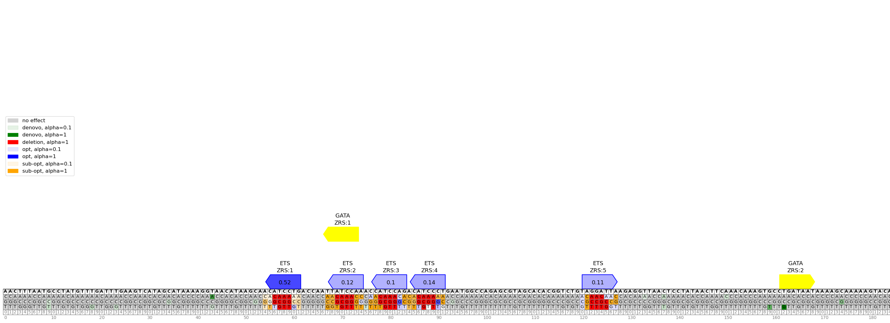
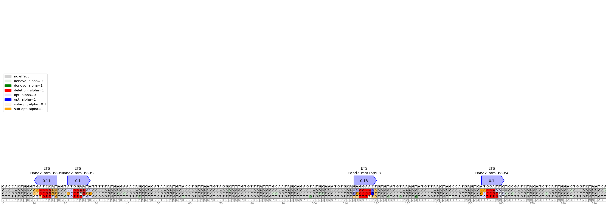

# tfsites.InSilicoSnvAnalysis v1

**Author(s):** Joe Solvason  

**Contact:** Joe Solvason (solvason@eng.ucsd.edu)

**Adapted as a GenePattern Module by:** Ted Liefeld (jliefeld@cloud.ucsd.edu)

**Task Type:** Transciption factor analysis

**LSID:**  urn:lsid:genepattern.org:module.analysis:00443


## Introduction

`annotateAndVisualizeInSilicoSnvs` reports the effects of all possible in-silico single-nucleotide variants (SNVs) in a given sequence. Possible SNV effects include increasing (or optimizing) the affinity of a binding site, decreasing (or sub-optimizing) the affinity of a binding site, deleting a binding site, or creating a binding site. 

The in-silico SNV analysis is performed on one transcription factor, but the binding sites of multiple different transcription factors can be shown on the plot. Each binding site is labeled with the TF name and a unique binding site ID. If the relative affinity PBM dataset is provided for a transcription factor, the affinity of this site will be labeled and the intensity of the binding site’s color will be proportional to the affinity.


## Methodology

For every nucleotide in the sequence, all possible SNVs are made. For each SNV, we determine its effect, if any, on any binding sites that exist in the sequence. These are the possible effects of a SNV on a binding site: 
- `inc`
    - The affinity of the binding site increases
    - The affinity fold change from the reference binding site to the alternate binding site is greater than 1
- `dec`
    - The affinity of the binding site decreases
    - The affinity fold change from the reference binding site to the alternate binding site is less than 1
- `denovo`
    - A binding site is created
    - The reference binding site didn't follow the IUPAC definition, but the alternate binding site follows it 
- `del`
    - A binding site is deleted
    - The reference binding site followed the IUPAC definition, but the alternate binding site didn’t follow it
  
If an optimization threshold is provided by the user, then we report only the binding sites that have an increased affinity with a fold change greater than or equal to the threshold. Similarly, if a sub-optimization threshold is provided, then we report only the binding sites that have a decreased affinity with a fold change less than or equal to the threshold. 

Using the list of all identified SNV effects, an image of the sequence and all possible alternate nucleotides is generated. Each cell in the table is colored according to the mutation type of the SNV. If the SNV has no effect, then its background is left blank. If a SNV has multiple effects, then its cell should be colored with all of the applicable colors. 

To find and plot all putative binding sites, we iterate across every k-mer in the DNA sequence and identify those that conform to the IUPAC definition for each transcription factor. Based on user selection, all denovo binding sites created from SNVs can be plotted as well. 

If the sequence is greater than 500 nucleotides in length, the annotation images are saved to multiple files. Each file contains a maximum of 500 nucleotides.


## Parameters

<span style="color: red;">*</span> indicates required parameter

### Inputs and Outputs

- <span style="color: red;">*</span>**DNA Sequences To Annotate (.tsv)**
    - This file contains one or more DNA sequences to be annotated. 
- **Relative Affinity PBM Data for SNV Analysis (.tsv)**
    - This file is the normalized PBM data file for a transcription factor obtained from defineTfSites. This is the transcription factor for which in-silico SNV analysis will be performed.
- **Relative Affinity PBM Data for Plotting (.tsv)**
    - `default = None`
    - This file is the normalized PBM data file for a transcription factor obtained from `defineTfSites.` This will be used to label the affinity of the binding sites that are plotted.
- **SNV Effects Output Table (.tsv)**
    - Name of the output file containing the list of SNVs and their effects. Every possible mutation for each position in the sequence is labeled on the plot, and it is color-coded by the mutation type as indicated by the provided legend.
- **Annotated Sequence Image(s) (.png)**
    - Base name of the output file for the plots. If the length of the sequence is greater than 500, the visualization will be broken up into multiple output files with the following name format: `[base name]_zoom=[start pos],[end pos].png`

### Other Parameters
- <span style="color: red;">*</span>**IUPAC Definition for SNV Analysis (string)**
    - IUPAC definition of the core binding site to conduct SNV analysis (see [here](https://www.bioinformatics.org/sms/iupac.html)).
- <span style="color: red;">*</span>**IUPAC Definition for Plotting Binding Sites (string)**
    - IUPAC definition of the core binding site to be plotted
- <span style="color: red;">*</span>**TF Name (string)**
    - Name of transcription factor to be plotted.
- <span style="color: red;">*</span>**Binding Site Color (string)**
    - Color of the binding sites on the plot, for a specific transcription factor 
- **SNV Effect (string)**
    - `default = None`
    - Specify one or more mutation types to analyze. SNV mutations can either increase (optimize) or decrease (sub-optimize) the affinity, delete a binding site, or create a binding site. Therefore, the possible mutation types are `inc`, `dec`, `denovo`, and `del`. This option also takes the value `all` if the user would like to analyze all of the listed mutation types.
- **Optimization Threshold (float)**
    - `default = 1`
    - Affinity fold-change threshold for affinity-increasing mutations. Only SNVs with fold change above this threshold will be reported. By default, all SNVs will be reported.
- **Sub-Optimization Threshold (float)**
    - `default = 1`
    - Affinity fold-change threshold for affinity-decreasing mutations. Only SNVs with fold change below this threshold will be reported. By default, all SNVs will be reported.
- **Plot Denovo Sites (boolean)**
    - `default = False`
    - If `True`, plot binding sites that would be created from denovo SNVs, in addition to existing binding sites. If `False`, only plot existing binding sites.
- **Plot Resolution (integer)**
    - `default = 200`
    - Resolution of the plot, in dots (pixels) per inch
- **Zoom Window (dash-separated string)**
    - `default = None`
    - Given a start position and an end position, zoom into a portion of the sequence. The numbers in the range are inclusive. For example, the first 200 nucleotides of the sequence would be specified as: `1-200.`
    - If zoom window is specified, then image output window is ignored
- **Image Output Window (integer)**
    - `default = 500`
    - Interval size (in nucleotides) used to partition the output plot. By default, the sequence will be divided into 500-nucleotide segments.
    - If image output window is specified, then zoom window is ignored


## Input Files

1.  DNA Sequences To Annotate (.tsv)
- Columns:
    - `Seq_name:` name of the DNA sequence
    - `Seq:` the sequence
 
```
seq_name	    seq
ZRS                 AACTTTAATGCCTATGTTTGATTTGAAGTCATAGCATAAAAGGTAACATAAGCAACATCCTGACCAATTATCCAAACCATCCAGACATCCCTGAATGGC...
Hand2_mm1689        CACCACTGGGTGATCCATAGTATGGAATATTTTTATGAGAAACAGCCACATAACATGTACCTGTTAATGTAGGCTTTGTGTTTATTTGCAATAGCAGAG...
```
    
2. Relative Affinity PBM data (.tsv)
- Columns
  - `Seq:` the sequence of every possible k-mer
  - `Rel_aff:` the relative affinity of the k-mer normalized to the max IUPAC k-mer

```
seq          rel_aff
AAAAAAAA     0.147
AAAAAAAC     0.107
AAAAAAAG     0.13
AAAAAAAT     0.125
AAAAAACA     0.123
```


## Output Files

1.  SNV Effects Output Table (.tsv)
- Columns:
    - `Seq_name:` name of the sequence being analyzed
    - `Kmer_id:` unique ID given to binding site
    - `Kmer_start-1idx:` position at which the binding site starts (1-indexed)
    - `Pos-1idx:` position of the SNV (1-indexed)
    - `Ref:` reference nucleotide
    - `Alt:` alternate nucleotide
    - `Ref_kmer:` reference binding site
    - `Alt_kmer:` alternate binding site
    - `Site_direction:` direction of the binding site (+ if it follows the given IUPAC or - if it follows the reverse complement of the IUPAC)
    - `Ref_aff:` the affinity of the reference binding site
    - `Alt_aff:` the affinity of the alternate binding site
    - `Fold_change:` the ratio between ref_aff and alt_aff
    - `Mut_type:` the type of SNV effect


2.  Annotated Sequence Image(s) (.png)

- ZRS sequence: 
   

- Hand2_mm1689 sequence:
   

  
## Example Data

[Example input data is available on github](https://github.com/genepattern/tfsites.inSilicoSnvAnalysis/data)
    
    
## Version Comments

- **1.0.0** (2023-01-12): Initial draft of document scaffold.
- **1.0.1** (2024-02-02): Draft completed.
