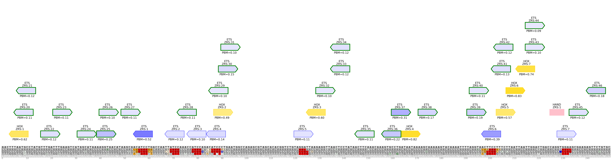
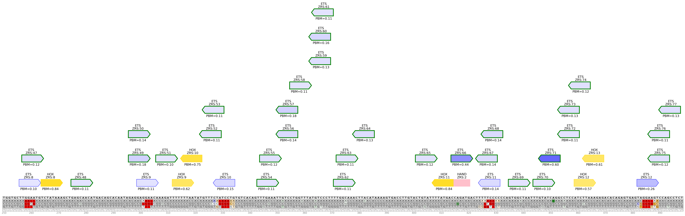
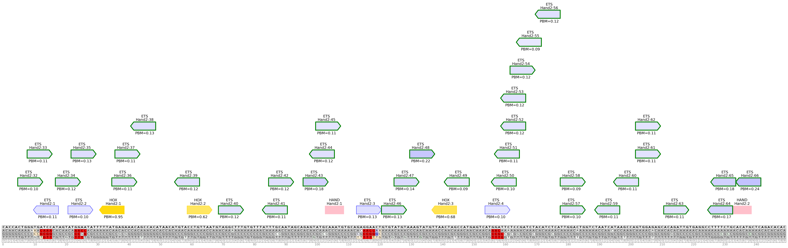
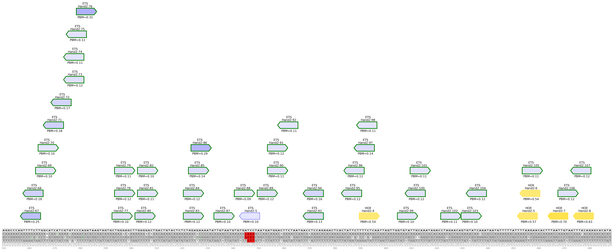

# tfsites.AnnotateAndVisualizeInSilicoSnvs v1

**Author(s):** Joe Solvason  

**Contact:** Joe Solvason (solvason@eng.ucsd.edu)

**Adapted as a GenePattern Module by:** Ted Liefeld (jliefeld@cloud.ucsd.edu)

**Task Type:** Transciption factor analysis

**LSID:**  urn:lsid:genepattern.org:module.analysis:00443


## Introduction

`AnnotateAndVisualizeInSilicoSnvs` reports the effects of all possible in silico single-nucleotide variants (SNVs) in a given sequence. Possible SNV effects include increasing (or optimizing) the affinity/score of a binding site, decreasing (or sub-optimizing) the affinity/score of a binding site, deleting a binding site, or creating a binding site. 

The in silico SNV analysis is performed on one transcription factor, but the binding sites of multiple different transcription factors can be displayed on the plot. Each binding site is labeled with the TF name and a unique binding site ID. If the relative affinity/score dataset is provided for a transcription factor, the affinity/score of this site will be labeled and the intensity of the binding site’s color will be proportional to the affinity/score.


## Methodology

For every nucleotide in the sequence, all possible SNVs are made. For each SNV, we determine its effect, if any, on any binding sites that exist in the sequence. These are the possible effects of a SNV on a binding site: 
- `inc`
    - The affinity/score of the binding site increases
    - The affinity/score fold change from the reference binding site to the alternate binding site is greater than 1
- `dec`
    - The affinity/score of the binding site decreases
    - The affinity/score fold change from the reference binding site to the alternate binding site is less than 1
- `denovo`
    - A binding site is created
    - The reference binding site didn't follow the binding site definition, but the alternate binding site follows it 
- `del`
    - A binding site is deleted
    - The reference binding site followed the binding site definition, but the alternate binding site didn’t follow it
  
If an optimization threshold is provided by the user, then we report only the binding sites that have an increased affinity/score with a fold change greater than or equal to the threshold. Similarly, if a sub-optimization threshold is provided, then we report only the binding sites that have a decreased affinity/score with a fold change less than or equal to the threshold. 

Using the list of all identified SNV effects, an image of the sequence is generated and it contains a table of all possible alternate nucleotides. Each cell in the table is colored according to the mutation type of the SNV. If the SNV has no effect, then its background is grey. If a SNV has multiple effects, then its background is white. 

To find and plot all putative binding sites, we iterate across every k-mer in the DNA sequence and identify those that conform to the binding site definition for each transcription factor. The user can also choose to plot all denovo binding sites created from SNVs, in addition to existing putative binding sites. 

The image can be outputted in one of two ways: (1) zoom into a portion of the sequence or (2) separate the entire sequence into windows. If the sequence is greater than 500 nucleotides in length, the sequence will automatically be separated into windows and outputted as separate files. The maximum size for each window is 500 nucleotides. 

## Parameters

<span style="color: red;">*</span> indicates required parameter

### Inputs and Outputs

- <span style="color: red;">*</span>**DNA sequence(s) to annotate (.tsv)**
    - File containing one or more DNA sequences to be annotated. 
- **PBM or PFM reference data for SNV analysis (.tsv)**
    - File containing the normalized PBM data obtained from `defineTFBindingSites.from.PBM` or normalized PFM data file from `defineTFBindingSites.from.PFM`. This is the transcription factor for which in silico SNV analysis will be performed.
- <span style="color: red;">*</span>**TF information for plotting (.tsv)**
    - File containing all the information for each transcription factor being plotted.
- **all TF reference data (.tsv)**
    - File(s) referenced in the TF information file.

### Other Parameters
- <span style="color: red;">*</span>**TF name for SNV analysis (string)**
    - Name of the transcription factor to use for SNV analysis.
- **SNV effects to report (string)**
    - `Default = all`
    - Specify one or more mutation types to analyze. SNV mutations can either increase (optimize) or decrease (sub-optimize) the affinity/score, delete a binding site, or create a binding site. Therefore, the possible mutation types are `inc`, `dec`, `denovo`, and `del`. This option also takes the value `all` if the user would like to analyze all of the listed mutation types.
- **plot denovo sites (boolean)**
    - `Default = False`
    - If `True`, plot the binding sites that would be created from denovo SNVs, in addition to existing binding sites. If `False`, only plot existing binding sites.
- **optimization threshold (float)**
    - `Default = 1`
    - Fold change threshold for mutations that increase the affinity/score. Only SNVs with fold change above this threshold will be reported. By default, all SNVs will be reported.
- **sub-optimization threshold (float)**
    - `Default = 1`
    - Fold change threshold for mutations that decrease the affinity/score. Only SNVs with fold change below this threshold will be reported. By default, all SNVs will be reported.
 
### Plotting Parameters
- <span style="color: red;">*</span>**output image format (string)**
    - Select the format in which the images will be outputted. `Zoom` indicates the region of the DNA sequence to visualize, given a start and end coordinate, which can be specified using the `zoom range` option below. `Windows` will output the entire DNA sequence into separate images. The size of the window, or the number of bases plotted per window, can be specified by the `window size` option below.
- **zoom range (dash-separated string)**
    - `Default = None`
    - Given a start position and an end position, zoom into a portion of the sequence. The numbers in the range are inclusive and 0-indexed. For example, the first 200 nucleotides of the sequence would be specified as: 0-199.
    - Ignored if `output image format = Windows`
- **window size (integer)**
    - `Default = 500`
    - Interval size (in nucleotides) to separate the output plot into. By default, the sequence will be divided into 500-nucleotide segments.
    - Ignored if `output image format = Zoom`
- **plot dimensions (comma-separated integers)**
    - `Default = None`
    - Height and width of the image in inches.
- **plot resolution (integer)**
    - `Default = 200`
    - Resolution of the plot, in dots (pixels) per inch.


## Input Files

1.  DNA sequence(s) to annotate (.tsv)
- Columns:
    - `Sequence Name:` name of the DNA sequence
    - `Sequence:` the sequence
 
```
Sequence Name	    Sequence
ZRS                 AACTTTAATGCCTATGTTTGATTTGAAGTCATAGCATAAAAGGTAACATAAGCAACATCCTGACCAATTATCCAAACCATCCAGACATCCCTGAATGGC...
Hand2               CACCACTGGGTGATCCATAGTATGGAATATTTTTATGAGAAACAGCCACATAACATGTACCTGTTAATGTAGGCTTTGTGTTTATTTGCAATAGCAGAG...
```

2. PBM or PFM reference data for SNV analysis (.tsv)
- Columns
  - `PBM Kmer:` the sequence of every possible k-mer
  - `PBM Relative Affinity:` the relative affinity of each k-mer normalized to the k-mer with the highest MFI

```
PBM Kmer     PBM Relative Affinity
AAAAAAAA     0.15
AAAAAAAC     0.11
AAAAAAAG     0.13
AAAAAAAT     0.13
AAAAAACA     0.12
```

3. TF information (.tsv)
- Columns:
    - `TF Name:` name of the transcription factor
    - `Binding Site Definition:` minimal IUPAC binding site definition for transcription factor
    - `Color:` binding site color on the output visualization
    - `PBM Reference Data:` relative affinity data obtained from `DefineTfSites.from.PBM` (optional)
    - `PFM Reference Data:` relative score data obtained from `DefineTfSites.from.PFM` (optional)
  
```
TF Name     Binding Site Definition     Color     PBM Reference Data           PFM Reference Data
ETS         NNGGAWNN                    blue      03-input_ets-norm-pbm.tsv	
HOX         NYNNTNAA                    gold      03-input_hox-norm-pbm.tsv	
HAND        CANNTG                      pink	       
```
    
4. all TF reference data (.tsv)
- Columns
  - `PBM Kmer:` the sequence of every possible k-mer
  - `PBM Relative Affinity:` the relative affinity of each k-mer normalized to the k-mer with the highest MFI

```
PBM Kmer     PBM Relative Affinity
AAAAAAAA     0.55
AAAAAAAC     0.56
AAAAAAAG     0.54
AAAAAAAT     0.54
AAAAAACA     0.56
```


## Output Files
1.  SNV effects output table (.tsv)
- Note: if PFM reference data is provided instead of PBM reference data, then the columns `Reference Affinity` and `Alternate Affinity` will instead be labeled `Reference Score` and `Alternate Score` 
- Columns:
    - `Sequence Name:` name of the sequence being analyzed
    - `Kmer ID:` unique ID given to binding site
    - `Start Position (0-indexed):` position at which the binding site starts
    - `Position (0-indexed):` position of the SNV
    - `Reference Nucleotide:` reference nucleotide
    - `Alternate Nucleotide:` alternate nucleotide
    - `Reference Kmer:` reference binding site
    - `Alternate Kmer:` alternate binding site
    - `Site Direction:` direction of the binding site (+ if it follows the given IUPAC or - if it follows the reverse complement of the IUPAC)
    - `Reference Affinity:` the affinity of the reference binding site
    - `Alternate Affinity:` the affinity of the alternate binding site
    - `Fold Change:` the ratio between `Reference Affinity` and `Alternate Affinity`
    - `SNV Effect:` the type of SNV effect


2.  annotated sequence image(s) (.png)

- ZRS sequence: 
   
   
   

- Hand2 sequence:
   
   
   

  
## Example Data

[Example input data is available on github](https://github.com/genepattern/tfsites.inSilicoSnvAnalysis/data)
    
    
## Version Comments

- **1.0.0** (2023-01-12): Initial draft of document scaffold.
- **1.0.1** (2024-02-02): Draft completed.
