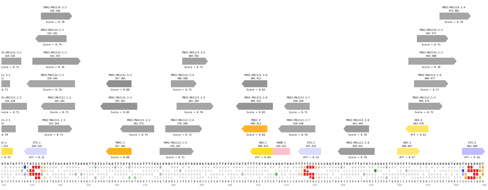
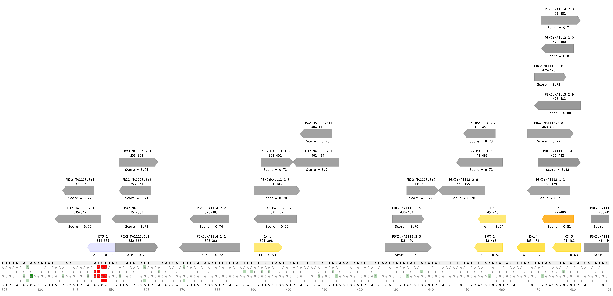

# tfsites.AnnotateAndVisualizeInSilicoSnvs v2

**Author(s):** Joe Solvason  

**Contact:** Joe Solvason (solvason@eng.ucsd.edu)

**Adapted as a GenePattern Module by:** Ted Liefeld (jliefeld@cloud.ucsd.edu)

**Task Type:** Transciption factor analysis

**LSID:**  urn:lsid:genepattern.org:module.analysis:00443


## Introduction

`AnnotateAndVisualizeInSilicoSnvs` reports the effects of all possible in silico single-nucleotide variants (SNVs) in a given sequence. Possible SNV effects include increasing (or optimizing) the affinity/score of a binding site, decreasing (or sub-optimizing) the affinity/score of a binding site, deleting a binding site, or creating a binding site. 

The in silico SNV analysis is performed on one transcription factor, but the binding sites of multiple different transcription factors can be displayed on the plot. Each binding site is labeled with a unique binding site ID and its start and end position. If reference data is provided for a transcription factor, the affinity/score of this site will be labeled and the intensity of the binding site’s color will be proportional to the affinity/score.


## Methodology

For every nucleotide in the sequence, all possible SNVs are made. For each SNV, we determine its effect, if any, on any binding sites that exist in the sequence. These are the possible effects of a SNV on a binding site: 
- `inc`
    - The affinity/score of the binding site increases
    - The affinity/score fold change from the reference binding site to the alternate binding site is greater than 1
- `dec`
    - The affinity/score of the binding site decreases
    - The affinity/score fold change from the reference binding site to the alternate binding site is less than 1
- `denovo`
    - A binding site is created
    - The reference k-mer is not a predicted binding site (it either didn't follow the binding site definition or didn't meet the minimum score threshold), but the alternate k-mer is a predicted binding site
- `del`
    - A binding site is deleted
    - The reference k-mer is a predicted binding site (it either followed the binding site definition or met the minimum score threshold), but the alternate k-mer is not a predicted binding site
  
If an optimization threshold is provided by the user, then we report only the binding sites that have an increased affinity/score with a fold change greater than or equal to the threshold. Similarly, if a sub-optimization threshold is provided, then we report only the binding sites that have a decreased affinity/score with a fold change less than or equal to the threshold. 

Using the list of all identified SNV effects, an image of the sequence is generated and it displays all possible alternate nucleotides. The background of each nucleotide is colored according to the mutation type of the SNV. If the SNV has no effect, then its background is blank. If a SNV has multiple effects, then its background will be split into multiple colors. The intensity of the background color is determined by the following options: (1) magnitude of the affinity/score fold change, if the SNV effect is `inc` or `dec`, (2) magnitude of the alternate k-mer's affinity/score, if the SNV effect is `denovo`, or (3) full intensity, if the SNV effect is `del`. 

To find and plot all putative binding sites, we iterate across every k-mer in the DNA sequence. If using PBM data, we identify the k-mers that conform to the binding site definition for each transcription factor. If using PFM data, we can also use a binding site definition but it is not required. If a site definition is not provided for PFM data, we use the minimum score to define a predicted binding site. The user can also choose to plot all denovo binding sites created from SNVs, in addition to existing putative binding sites. 

If the user wishes to analyze only a portion of the sequence, then a zoom range can be specified. If the sequence is greater than 500 nucleotides in length, the sequence will automatically be separated into 500-bp windows and outputted as separate files. In addition, the individual files will be appended together to create a single output file with the entire sequence. The user can also choose to output the files in `.svg` format in addition to `.png`.

## Parameters

<span style="color: red;">*</span> indicates required parameter

### Inputs and Outputs
- <span style="color: red;">*</span>**DNA sequence(s) to annotate (.tsv)**
    - File containing one or more DNA sequences to be annotated. 
- **TF information (.tsv)**
    - File containing all the information for the transcription factors being plotted. This can include the transcription factor that is being used for SNV analysis.
- **all TF reference data (.tsv)**
    - File(s) referenced in the TF information file.
- **batch PFM custom data (.txt)**
    - File containing all PFM matrices to predict binding sites. This can include the transcription factor that is being used for SNV analysis. ????????
 
### PFM Parameters
- **batch PFM minimum score (float)**
    - `Default = 0.7`
    -  Required PFM score to predict a site. Does not apply to PFMs referenced in the “TF information” file. 
- **batch PFM predicted site color (string)**
    - `Default = grey`
    - Color of sites for PFMs. Find color options [here](https://matplotlib.org/stable/gallery/color/named_colors.html). 
- **use pseudocounts to calculate score (boolean)**
    - `Default = False`
    - Choose if you want to use pseudocounts. Find description of pseudocounts [here]().

### Plotting Parameters
- **output svg (boolean)**
    - `Default = False`
    - Option to output images as `.svg` in addition to `.png`. For manuscript preparation, `.svg` format is preferable.
- **plot only snv table (boolean)**
    - `Default = False`
    - If `True`, only print the table containing SNV effects with no plotting binding site. If `False`, plot both binding sites and SNV table. 
- **plot resolution (integer)**
    - `Default = 200`
    - Resolution of the plot, in dots (pixels) per inch. Manuscripts require 300 DPI. The DPI does not affect the resolution of `.svg` files.
- **zoom range (dash-separated string)**
    - `Default = None`
    - Given a start position and an end position, zoom into a portion of the sequence. The numbers in the range are inclusive and 1-indexed. For example, the first 200 nucleotides of the sequence would be specified as: 1-200.

### Other Parameters
- <span style="color: red;">*</span>**TF name for SNV analysis (string)**
    - Name of the transcription factor to use for SNV analysis.
- **SNV effects to report (string)**
    - `Default = all`
    - Specify one or more mutation types to analyze. SNV mutations can either increase (optimize) or decrease (sub-optimize) the affinity/score, delete a binding site, or create a binding site. Therefore, the possible mutation types are `inc`, `dec`, `denovo`, and `del`. This option also takes the value `all` if the user would like to analyze all of the listed mutation types.
- **plot denovo sites (boolean)**
    - `Default = False`
    - If `True`, plot the binding sites that would be created from denovo SNVs, in addition to existing binding sites. If `False`, only plot existing binding sites.
- **optimization threshold (float)**
    - `Default = 1`
    - Fold change threshold for mutations that increase the affinity/score. Only SNVs with fold change above this threshold will be reported. By default, all SNVs will be reported.
- **sub-optimization threshold (float)**
    - `Default = 1`
    - Fold change threshold for mutations that decrease the affinity/score. Only SNVs with fold change below this threshold will be reported. By default, all SNVs will be reported.


## Input Files

1.  DNA sequence(s) to annotate (.tsv)
- Columns:
    - `Sequence Name:` name of the DNA sequence
    - `Sequence:` the sequence
 
```
Sequence Name	    Sequence
ZRS                 AACTTTAATGCCTATGTTTGATTTGAAGTCATAGCATAAAAGGTAACATAAGCAACATCCTGACCAATTATCCAAACCATCCAGACATCCCTGAATGGC...
Hand2               CACCACTGGGTGATCCATAGTATGGAATATTTTTATGAGAAACAGCCACATAACATGTACCTGTTAATGTAGGCTTTGTGTTTATTTGCAATAGCAGAG...
```

2. TF information (.tsv)
- Columns:
    - `TF Name:` name of the transcription factor
    - `Color:` binding site color on the output visualization
    - `Binding Site Definition:` minimal IUPAC binding site definition for transcription factor (optional)
    - `Reference Data:` relative affinity data obtained from `DefineTfSites.from.PBM` or relative score data (optional)
    - `Minimum Score:` threshold required to predict a binding site using PFM scoring (optional)
    - `Minimum Affinity:` threshold required to plot binding sites above a certain affinity (optional)
 
```
TF Name    Color       Binding Site Definition    Reference Data                Minimum Score   Minimum Affinity
ETS        blue        NNGGAWNN                   input_ets1-pbm.tsv    
HOX        gold        NYNNTNAA                   input_hoxa13-pbm.tsv                          0.12
HAND       pink        CANNTG
PBX2       orange                                 input_MA1113.3-pbx2-pfm.txt   0.8
```
    
3. all TF reference data (.tsv)
- Can provide more than one file

ETS
```
PBM Kmer     PBM Relative Affinity
AAAAAAAA     0.15
AAAAAAAC     0.11
AAAAAAAG     0.13
AAAAAAAT     0.13
AAAAAACA     0.12
```

HOX
```
PBM Kmer     PBM Relative Affinity
AAAAAAAA     0.55
AAAAAAAC     0.56
AAAAAAAG     0.54
AAAAAAAT     0.54
AAAAAACA     0.56
```

PBX2
```
>MA1113.3	PBX2
A  [  4925  26620    225  24368  27245  27259    704   2298  25945 ]
C  [ 19645    629    588   2266    574    754    453  23894    848 ]
G  [  1585   1710    317    817    343    569    327    555    352 ]
T  [  3441    637  28466   2145   1434   1014  28112   2849   2451 ]
```


## Output Files
1.  SNV effects output table (.tsv)
- Columns:
    - `Sequence Name:` name of the sequence being analyzed
    - `Kmer ID:` unique ID given to binding site
    - `SNV Position (0-indexed):` position of the SNV
    - `Reference Nucleotide:` reference nucleotide
    - `Alternate Nucleotide:` alternate nucleotide
    - `Start Position (1-indexed):` position at which the k-mer starts, where counting begins at one
    - `End Position (1-indexed):` position at which the k-mer ends, where counting begins at one
    - `Reference Kmer:` reference k-mer
    - `Alternate Kmer:` alternate k-mer
    - `Site Direction:` direction of the binding site 
    - `Reference Value:` the affinity/score of the reference binding site
    - `Alternate Value:` the affinity/score of the alternate binding site
    - `Fold Change:` the ratio between `Reference Value` and `Alternate Value`
    - `SNV Effect:` the type of SNV effect


2.  annotated sequence image(s) (.png)

- ZRS sequence: 
   

- Hand2 sequence:
   

  
## Example Data

[Example input data is available on github](https://github.com/genepattern/tfsites.AnnotateAndVisualizeInSilicoSNVAnalysis/data)
    
    
## Version Comments

- **1.0.0** (2023-01-12): Initial draft of document scaffold.
- **1.0.1** (2024-02-02): Draft completed.
